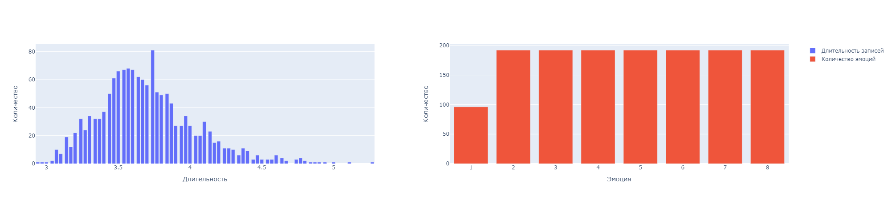
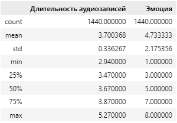

# Speech Emotion Recognition
## Модель для определения эмоциональной окраски речи.

**Цель:** Распределение аудио-сообщений по эмоциональной окраске для дальнейшего использования в качестве части дискриминатора в модели генерации речи[^1].

**Задачи:**
1.	анализ существующих решений;
2.	сбор данных и их обновление;
3.	обучение и оценка моделей на исходном датасете;
4.	выбор модели с наибольшим значением точности;
5.	оценка качества и скорости работы модели на новых аудио-сообщениях путем A / B тестирования;
6.	выбор и развертывание наилучшей модели;
7.	оптимизация выбранной модели путем квантизации и дистилляции;
8.	развертывание оптимизированной модели, количественная оценка эффекта оптимизации.

**Датасет:** [RAVDESS. Датасет эмоциональных речей и песен.](https://zenodo.org/record/1188976#.ZFdujSPP1hH)

**Проект:** [sikoraaxd/speech-emotion-recognition](https://github.com/sikoraaxd/speech-emotion-recognition)

**Целесообразность использования датасета для решения поставленной задачи:** Датасет состоит из 1440 записей речей с разными эмоциональными окрасками, проговорённых 24 дикторами по 60 записей на каждого. Каждая аудиозапись помечена эмоциональной окраской от 1 - нейтральной до 8 - удивлённой.

**Обработка датасета:** Каждый аудиосигнал следует привести к одинаковой длительности, сместить на случайное значение, извлечь из него спектрограмму и наложить на неё частотную и временную маску.

**Практическая значимость:** Модель будет использоваться как часть дискриминатора при генерации речи обучающей моделью. Дискриминатор будет штрафовать варианты генератора, не подходящие по эмоцианальной окраске. Таким образом, данная модель поможет добавить экспрессивности к генерируемой речи.

**Краткая информация о датасете:** 

На рисунке 1 показано распределение количества записей (ось Y) в зависимости от их длительности в секундах (ось X слева) и эмоции (ось X cправа).

Рисунок 1 - Распределение количества записей от их длительности и эмоции

***Статистические данные:*** количество данных, средняя продолжительность записи, стандартное отклонение и перцентили.

Рисунок 2 - Статистические данные

[^1]: Магистерская диссертация на тему: Обучающая слухоречевому навыку информационная система на основе генеративно-состязательной сети.
